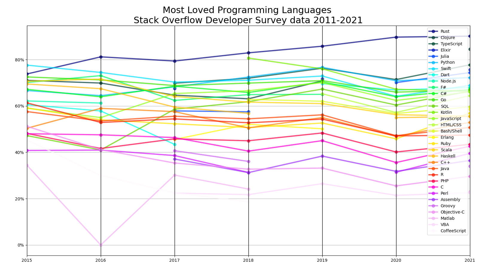

pyverflow graphs
-
Nicely (not yet though) displaying stackoverflow developer survey data since 2015 till 2021 (as of the time of writing)

### How to prepare data
1. Download all of the data from [here](https://insights.stackoverflow.com/survey)
2. Create directories for each folder `mkdir {2011..2021}`
3. Extract each archive to its folder `for i in {2011..2021}; do unzip "stack-overflow-developer-survey-$i.zip" -d $i; done`
4. Run `process_data.py` (it's messy. I know)

### How to run 
`python main.py`